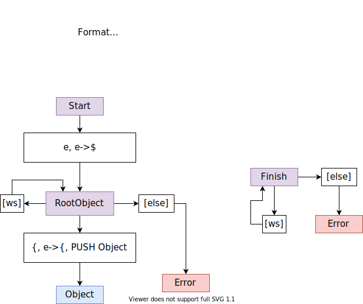
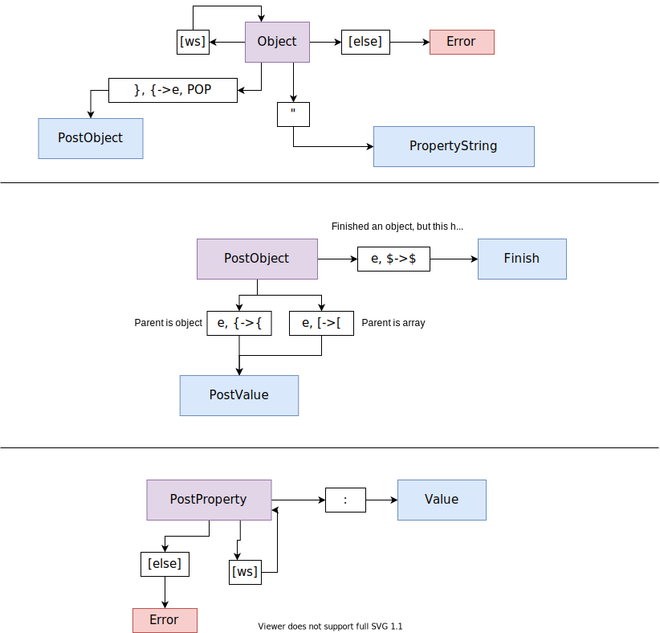
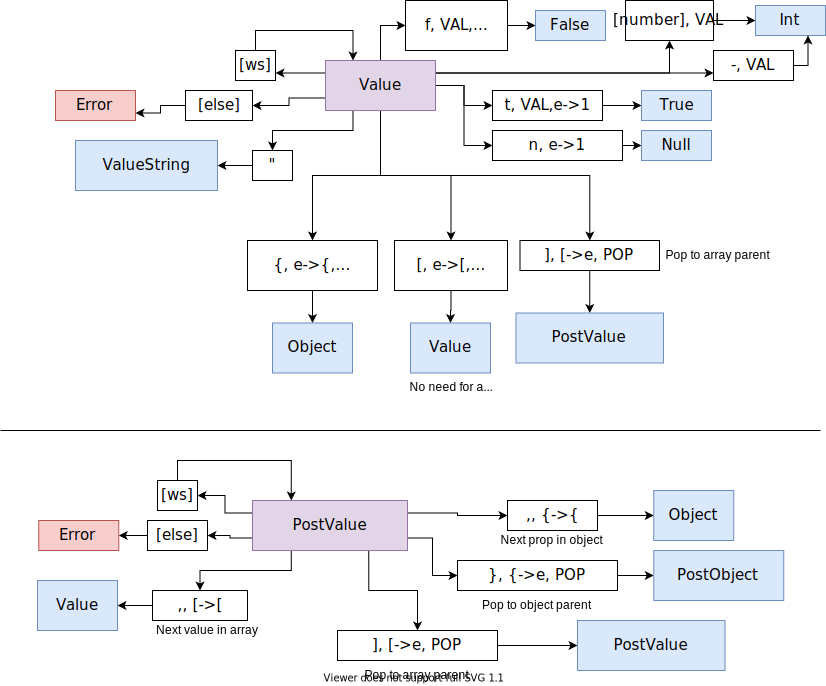
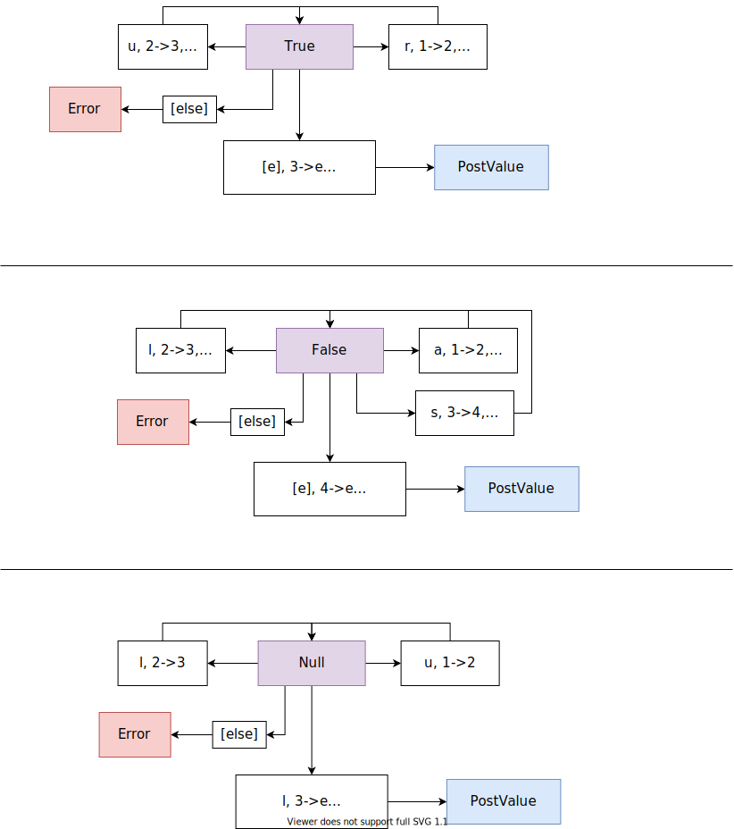

# JSON Reader CPP
This is a minimal C++ JSON reader based on a pushdown automaton (with some tweaks). The code makes only one pass, building a JSON tree in code as it goes.

There are no dependancies (besides for the C++17 STL), and should compile cross-platform without any issues.

# Example

A simple example is in the main.cc:

```
int main(int argc, char *argv[])
{
	JsonReader parser;
	std::optional<JValue> parsed_json = parser.ParseJsonString(cin);

	if (parsed_json.has_value())
		PrintJsonTree(parsed_json.value());
	else
		cout << "No root object in JSON\n";
	

	return 0;
}
```

`JsonReader` is the main class the does the parsing - it's thread safe and doesn't hold any parsing state in the class members, so the same `JsonReader` instance can be reused to parse many JSON strings, even from different threads.

`JValue` represents a node in the JSON tree. You can inspect the type with `GetValueType()`, loop through children with `GetChildren()`, or get specific children by index or name with the `[]` operator. For scalar values, `JValue` also has `GetStringValue()`, `GetNumberValue()`, and `GetBooleanValue()`- these all try to convert the raw value, but return a `std::optional` in case it cannot be converted.

# PDA States
## Start (docs/JSON_Start.svg)


## Object (docs/JSON_Object.svg


## Value and Array (docs/JSON_Value_and_Array.svg) 
 

## Bool and Null (docs/JSON_Bool_and_Null.svg)


## String (docs/JSON_String.svg)


## Number (docs/JSON_Number.svg)
